# Sound xR SDK for Unity チュートリアル

Sound xR SDK for Unity に同梱されているサンプルシーンを用いて、Sound xR SDK の基本的な使い方を学びます。

Table of Contents
===

サンプル

   * [Honoka](#Honoka)
   * [SpatializedAudio](#SpatializedAudio)

その先へ

   * [独自プロジェクトにアセットを追加する](#AddUnityAsset)

---

## Honoka

ヤマハが提供する xRイヤホン「Honoka」を使用するサンプルです。  
本サンプルでは、iOS 端末から Honoka に対して BLE検出・接続、ボリュームUp/Down、トラッキングOn/Off、ANC/HT切替制御をすることができます。  

1. サンプルシーンの読込

   1-1. SoundXR/Examples/honoka/Scenes/Honoka.unity を開きます。
   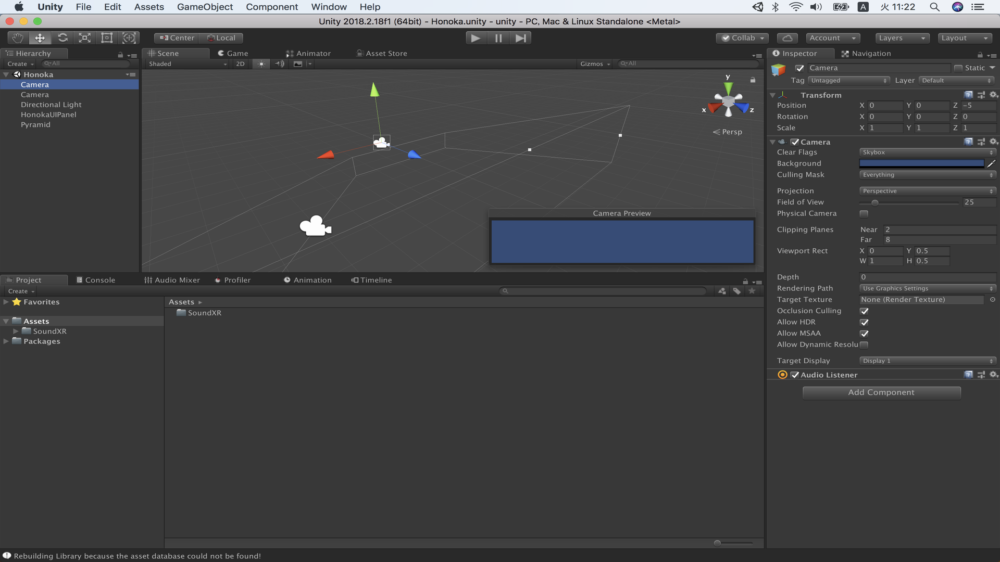

   サンプルシーンには、以下の Prefab を使用しています。
      * [HonokaUIPannel]() : Honoka のBLE接続やボリュームUp/Down 等を行うサンプルUIです。

2. トラッキング対象となるオブジェクトの設定

   2-1. HonokaUIPannel プレファブにアタッチされている HonokaDevice.cs スクリプトの ObjectToRotate 変数に、トラッキングを反映させたいオブジェクトを指定します。
   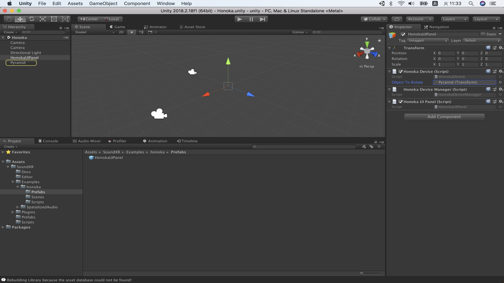

3. ビルド＆実行

   3-1. Mac に iOS端末をUSB接続します。

   3-2. File > Build And Run を実行します。

   3-3. Xcode が起動し、iOS端末でビルド済アプリが実行されます。

## Spatialized Audio

ヤマハ独自の立体音響技術 ViReal(TM) のうち、ヘッドホン立体音響技術 ViReal for Headphones の UnityNativeAudioPlugin を使用するサンプルです。  
本サンプルでは、 mono in / stereo out / 48kHz のオブジェクトベース立体音響処理をすることができます。  

1. サンプルシーンの読込

   1-1. SoundXR/Examples/SpatializedAudio/Scenes/SpatializedAudio.unity を開きます。
   

   サンプルシーンには、以下２つの Prefab を使用しています。
      * [ViRealAudioSource]() : 立体音響処理したいオブジェクトに追加するコンポーネント。
      * [ViRealAudioListener]() : 受聴者に追加するコンポーネント。AudioListener で代用可能。

2. Spatializer のパラメータを変更する場合

   2-1. パラメータを変更したい AudioSource に ViRealAudioSource.cs コンポーネントに追加します。

   2-2. API の [AudioEffectManager.ViReal]() パラメータをインスペクターから変更できます。

   2-3. ViRealAudioSource.cs に記述されている AudioSource.SetSpatialzierFloat 関数 を使うことで、独自の Script から変更することも可能です。

3. ビルド＆実行

   3-1. Mac に iOS端末をUSB接続します。

   3-2. File > Build And Run を実行します。

   3-3. Xcode が起動し、iOS端末でビルド済アプリが実行されます。

- Tips
1. 立体音響処理を有効にする一番単純な方法は、 AudioSource コンポーネントの Inspector にて、Spatializer チェックボックスを ON にするだけです。
2. Unity 標準の距離減衰カーブを使用する場合は、ViRealAudioSource.cs の DistanceDecay チェックボックスを OFF にしてください。
3. 音源までの距離感を表現するために、リバーブと併用することを推奨します。

## 独自プロジェクトにアセットを追加する

1. プロジェクトの新規作成

   1-1. Unity Hub を起動し、新規 をクリックします。
   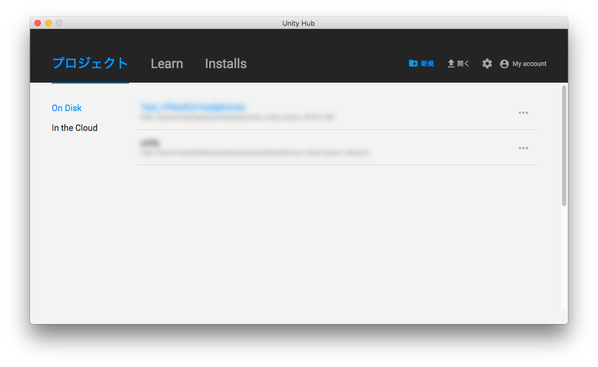

   1-2. 以下の設定で Create project をクリックします。
      * Project name : 任意
      * Template : **3D**
      * Location : 任意
      * Enable Unity Analytics : 任意

      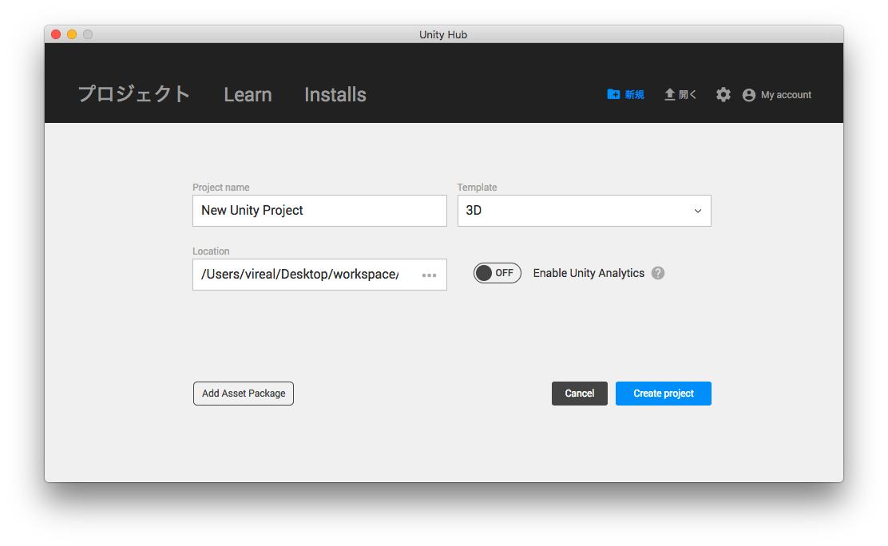

2. Platform を iOS に変更

   2-1. File > Build Settings > Platform を iOS にし、Switch Platform を実行します。
   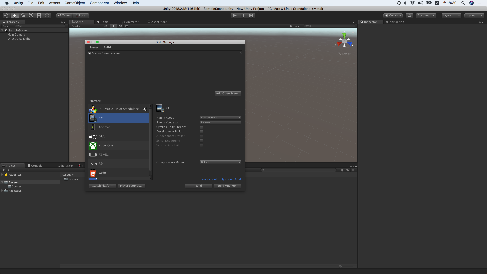

3. Sound xR SDK Unity アセットの追加と基本設定

   3-1. Assets > Import Package > Custom Package... から sound_xr.unitypackage をインポートします。
   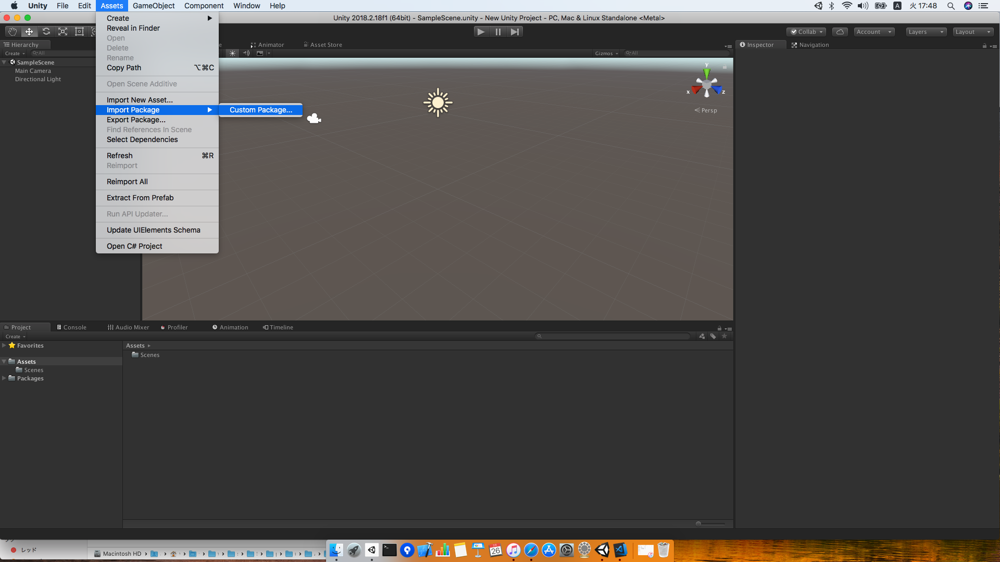

   3-2. 全てのチェックボックスが有効であることを確認し、Import をクリックします。
   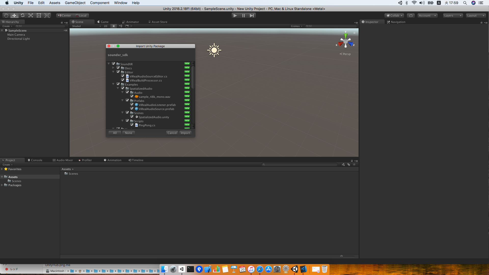

   3-3. Edit > Project Settings > Audio > Spatializer Plugin にて、"ViRealHeadphone" を選択します。
   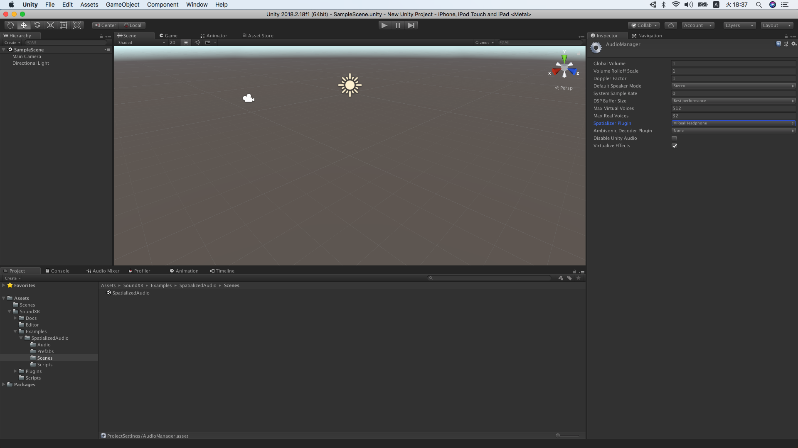

4. Honoka デバイスを制御するプレファブを追加

   4-1. Hierarchy に Prefabs/HonokaDeviceManagerController.prefab を追加します。
   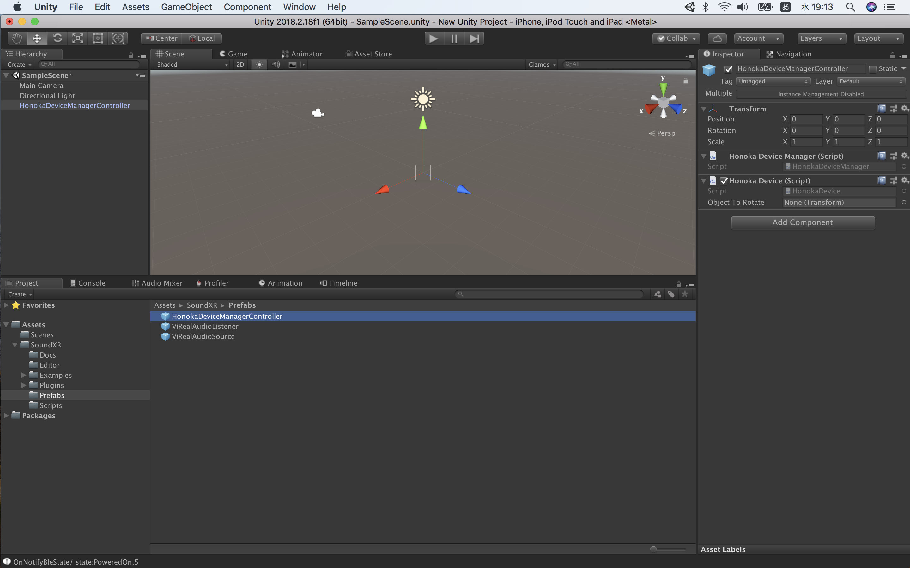

   4-2. HonokaDeviceManagerController > HonokaDevice にて、Honoka デバイスのトラッキング対象オブジェクトを指定します。  
   下記例では MainCamera をトラッキング対象としています。
   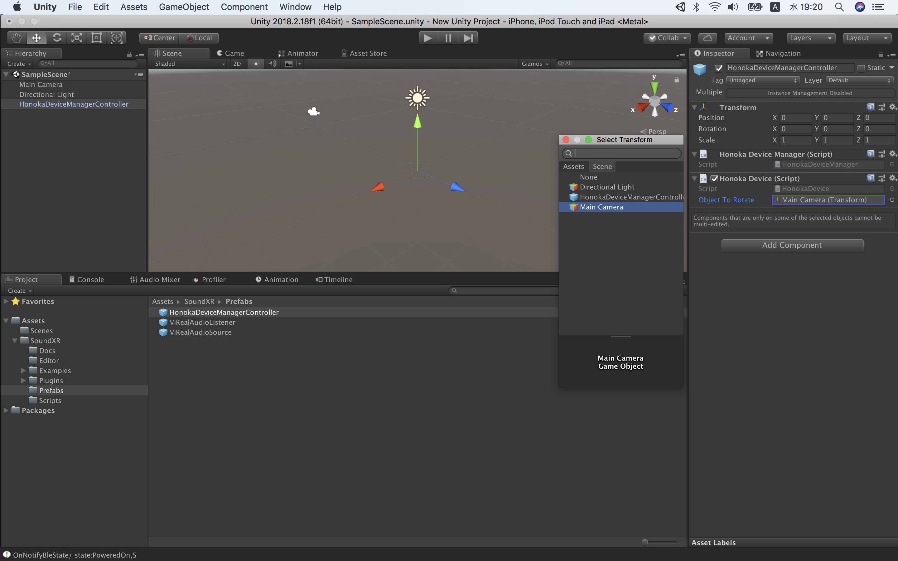

   4-3. 追加した HonokaDeviceManagerController を操作する独自スクリプトを追加します。  
   下記例では、サンプルコード HonokaUIPanel.cs を追加します。
   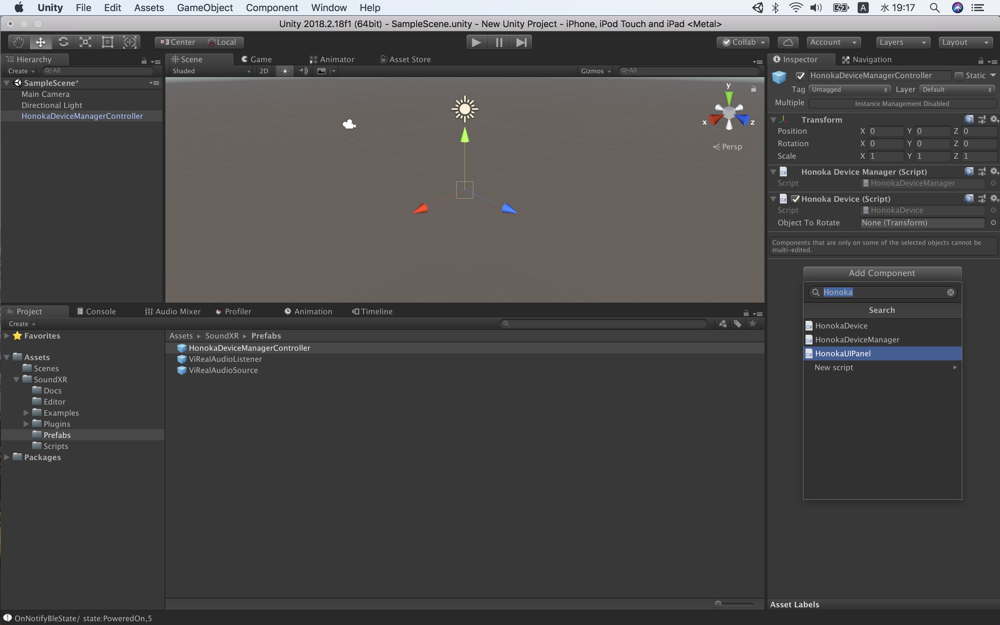

5. 任意の音源に立体音響処理を有効化する

   5-1. 立体音響処理したいオブジェクトに ViRealAudioSource.cs コンポーネントを追加します。
   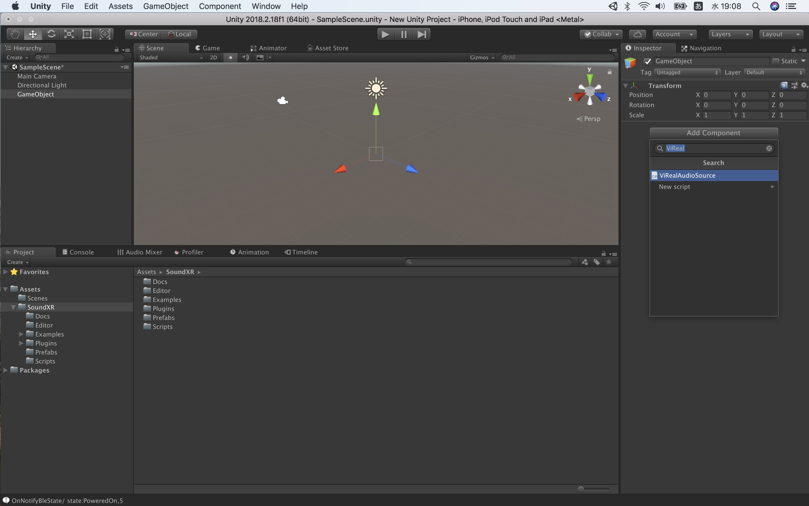

   5-2. AudioSource の Spatializer チェックボックスを ON にします。
   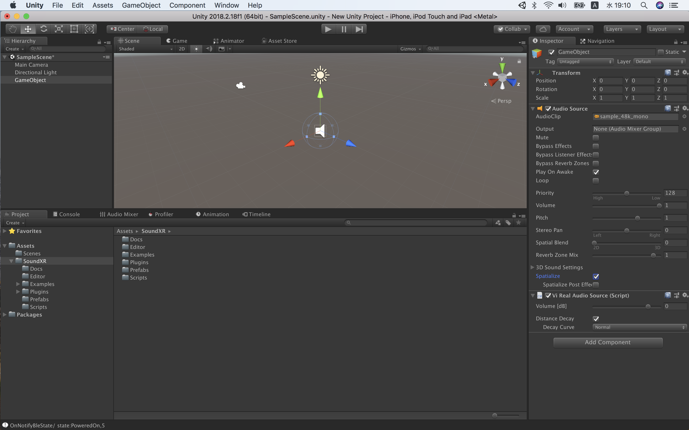

--

(C) 2019 Yamaha Corporation Confidential
